# Harborstone Insurance — Person 2 Architecture & Integration Guide

This document details the **Failure/Ticket System**, **Real MCP Integration**, **Real LLM Planning Techniques**, and **RAG Integration** implemented for Person 2's scope on the Harborstone Marine Insurance platform.

---

## 1. System Architecture Overview

```mermaid
flowchart TD
    subgraph StateGraphWorkflows [State Graph Workflows]
        G1[Graph 1: Auto Claim<br/>Constrained ReAct + RAG]
        G2[Graph 2: Policy Cancellation<br/>Tree of Thoughts + RAG]
        G3[Graph 3: Vehicle Addition<br/>Task Decomposition + ReAct]
    end

    subgraph FailureAndRecovery [Failure & Ticket Lifecycle]
        Fail[Unexpected Error / Tool Failure] -->|1. Capture Node & Version| ChkSafe[CheckpointManager<br/>Save Safe Checkpoint]
        ChkSafe -->|2. Create Persistent Ticket| TM[TicketManager<br/>Status: OPEN]
        TM -->|3. Mark FAILED| StateFailed[GraphState: FAILED]
        StateFailed -->|4. Trigger Recovery| Rec[Graph.recover run_id]
        Rec -->|5. Load Latest Checkpoint| Res[Graph.resume_after_failure]
        Res -->|6. Status: INVESTIGATING| TMInv[TicketManager: INVESTIGATING]
        Res -->|7. Continue Workflow| StateRun[GraphState: RUNNING]
        StateRun -->|8. On Completion / Step Success| TMRes[TicketManager: RESOLVED]
    end

    subgraph RealIntegration [Real LLM & MCP Integration]
        MCPExec[HarborstoneMCPExecutor<br/>stdio MCP client] <--> MCPServer[FastMCP Server<br/>mcp_server/server.py]
        LangChainLLM[LangChain BaseChatModel] <--> LLMTools[llm_tools.py]
        RAGRetriever[PolicyRAGRetriever / HybridRAG] <--> VectorStore[ChromaDB / BM25]
    end

    G1 --> FailureAndRecovery
    G2 --> FailureAndRecovery
    G3 --> FailureAndRecovery

    G1 --> RealIntegration
    G2 --> RealIntegration
    G3 --> RealIntegration
```



---

## 2. Persistent Failure / Ticket System

### Ticket Lifecycle

Failure tickets follow a strict 3-phase lifecycle:

$$\text{OPEN} \xrightarrow{\text{recover() / resume\_after\_failure()}} \text{INVESTIGATING} \xrightarrow{\text{workflow step resolved}} \text{RESOLVED}$$

- **`OPEN`**: Created immediately upon unexpected error during state graph execution. Persists `run_id`, `failed_node`, `failure_type`, `error_message`, `checkpoint_version`, and metadata.
- **`INVESTIGATING`**: Set when `resume_after_failure()` is called. Increments the `recovery_attempts` counter.
- **`RESOLVED`**: Set when the graph successfully completes or advances past the failure point, storing the `resolution_note`.

### Failure Types (`FailureType` Enum)
- `MCP_FAILURE`: External MCP tool exception, connection dropout, or invalid payload.
- `LLM_FAILURE`: LLM invocation failure, token limit exhaustion, or schema validation error.
- `RAG_FAILURE`: Vector DB or document retrieval exception.
- `VALIDATION_FAILURE`: Incomplete documents or broken underwriting invariants.
- `UNEXPECTED_ERROR`: General runtime or system exception.

### Database Schema (`FailureTickets` Table)

```sql
CREATE TABLE IF NOT EXISTS FailureTickets (
    ticket_id VARCHAR(100) PRIMARY KEY,
    run_id VARCHAR(100) NOT NULL,
    graph_name VARCHAR(100) NOT NULL,
    failed_node VARCHAR(100) NOT NULL,
    failure_type VARCHAR(50) NOT NULL,
    error_message TEXT NOT NULL,
    checkpoint_version INT NOT NULL,
    status VARCHAR(50) NOT NULL DEFAULT 'OPEN',
    recovery_attempts INT NOT NULL DEFAULT 0,
    resolution_note TEXT NULL,
    metadata JSON NULL,
    created_at DATETIME DEFAULT CURRENT_TIMESTAMP,
    updated_at DATETIME DEFAULT CURRENT_TIMESTAMP ON UPDATE CURRENT_TIMESTAMP,

    FOREIGN KEY (run_id) REFERENCES GraphRuns(run_id) ON DELETE CASCADE
);
```

---

## 3. Real MCP & LLM Technique Integration

### State Graph Technique Mapping

Every state graph meaningfully incorporates at least **TWO** advanced techniques:

| Graph | Technique 1 | Technique 2 | Description |
|---|---|---|---|
| **Graph 1: Auto Claim** | **Constrained ReAct** | **RAG** | Uses `PolicyRAGRetriever` to fetch official policy terms and deductible rules; uses `run_constrained_react` with strict required evidence constraints (`accident_photos`, `police_report`, `repair_report`) without hallucination. |
| **Graph 2: Policy Cancellation** | **Tree of Thoughts (ToT)** | **RAG** | Uses `PolicyRAGRetriever` for cancellation and refund terms; invokes `run_tree_of_thoughts` (`tree_of_thoughts` BFS search) to generate and evaluate candidate customer retention incentives. |
| **Graph 3: Vehicle Addition** | **Task Decomposition** | **Constrained ReAct** | Uses `run_task_decomposition` for entity extraction and subtask planning; uses `run_constrained_react` to validate required vessel documents (`proof_of_ownership`, `vehicle_registration`, `valuation_report`). |

### Real MCP Client & Server Integration
- **`call_mcp_tool_sync()`**: Synchronously wraps `HarborstoneMCPExecutor` (from `planning/integration/mcp_executor.py`), driving tool calls over stdio transport against `mcp_server/server.py`.
- **`apply_cancellation_rules`**: Implemented in FastMCP server to compute policy-specific administrative fees ($150) and pro-rata refund calculations directly against the database.
- **`ALLOWED_MCP_TOOLS`**: Updated in `planning/models.py` to include `get_vessel` and `apply_cancellation_rules`.

---

## 4. Checkpoint-Based Recovery (No Restart from START)

When an unexpected failure occurs:
1. `handle_failure()` saves a durable snapshot at the exact failed node with the current `checkpoint_version`.
2. A `FailureTicket` is persisted in `FailureTickets` referencing that checkpoint.
3. Upon calling `recover(run_id)` / `resume_after_failure()`, the latest state is deserialized from `GraphCheckpoints` (or memory store).
4. The ticket transitions from `OPEN` $\to$ `INVESTIGATING`.
5. Execution resumes **at the failed node**, bypassing all previously completed steps without restarting from `START`.
6. If the recovery attempt fails again, `recovery_attempts` is incremented and the ticket remains `INVESTIGATING`.

---

## 5. Summary of Audit Bugs Fixed

| # | Issue | Root Cause | Resolution |
|---|---|---|---|
| 1 | `SemanticStore.retrieve()` missing | `SemanticStore` was a pure fact store without text search | Added `retrieve(query, top_k)` to `SemanticStore` + created `PolicyRAGRetriever` combining ChromaDB & hybrid fallback. |
| 2 | `agent/planning_agent.py` parameter mismatch | Subtask routing passed arguments in wrong order | Updated all call sites for `plan_and_solve`, `tree_of_thoughts_search`, `lats_search`, `self_refine`, and `run_reflexion`. |
| 3 | MCP Schema key mismatch in `environment.py` | `REQUIRED_MCP_KEYS` looked for nonexistent `estimated_change` | Corrected keys to `estimated_additional_premium` and `estimated_new_premium`. |
| 4 | Missing `apply_cancellation_rules` MCP tool | Graph 2 called tool that was not exposed on MCP server | Implemented `apply_cancellation_rules` in `mcp_server/server.py` and `server.py`. |
| 5 | `ALLOWED_MCP_TOOLS` missing `get_vessel` | `Task` model validator rejected valid tool | Added `get_vessel` and `apply_cancellation_rules` to whitelist in `planning/models.py`. |
| 6 | Checkpoint DB dependency in tests | Unit tests required active MySQL server | Added `in_memory: bool` mode with seamless fallback to `CheckpointManager` and `TicketManager`. |

---

## 6. How to Run Tests

```bash
# Run Person 2 Test Suite (8 unit/integration tests covering tickets, MCP, LLM, recovery, and techniques)
python -m pytest state_graph/test_person2_suite.py -v

# Run Planning Evaluation Tests
python -m pytest planning_eval/test_planning_algorithms.py -v
```
